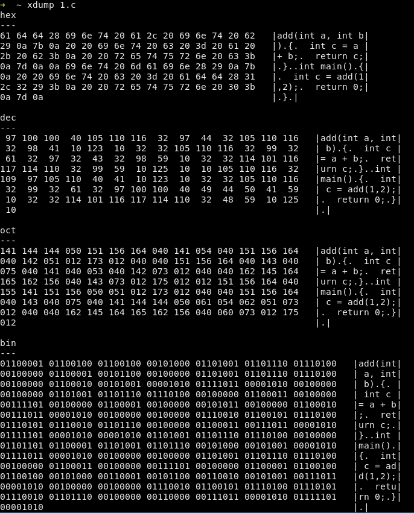
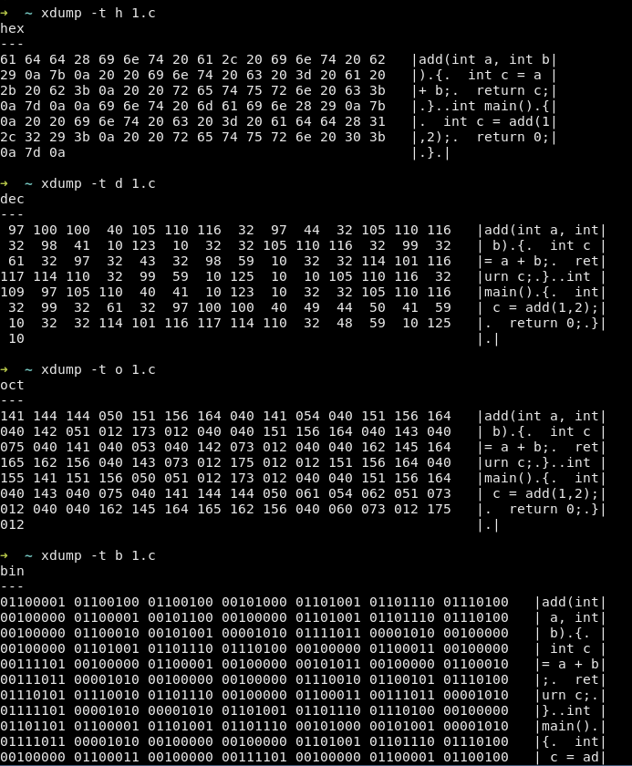

# xdump

xdump is a tool to display file contents in hexadecimal, decimal, octal, binary

## build and install on Linux and Mac OS X

steps:

1. install rust (https://www.rust-lang.org/tools/install)
2. [optional] setup mirror of crates.io to speed up building process in China.
    ```
    mkdir -p ~/.cargo
    echo > ~/.cargo/config <<EOF
    [source.crates-io]
    replace-with = 'ustc'
    
    [source.ustc]
    registry = "https://mirrors.ustc.edu.cn/crates.io-index"
    EOF
    ```
3. git clone https://github.com/yaguozhou/xdump.git
4. bash install_on_local.sh
5. chmod +x ~/.cargo/bin/xdump
6. execute `xdump --help` and enjoy.




